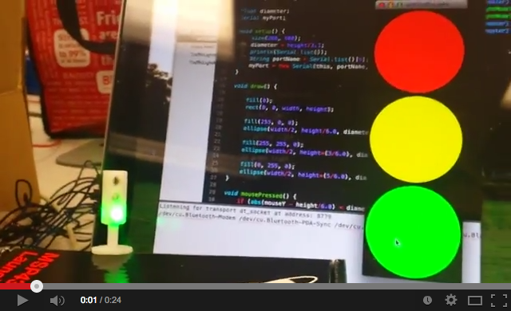
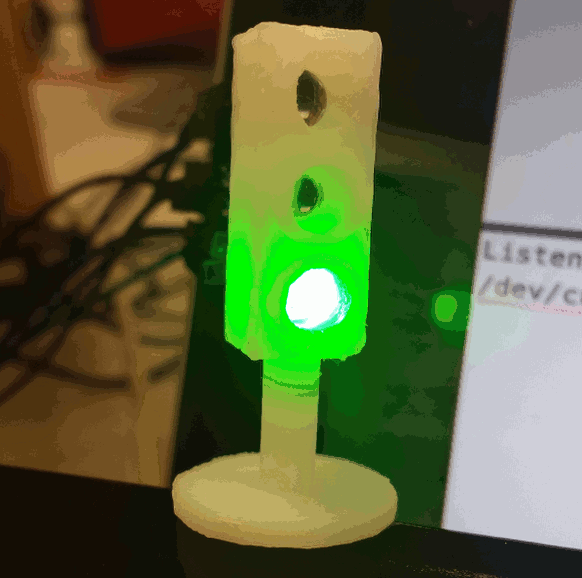
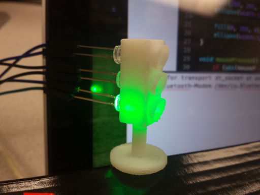
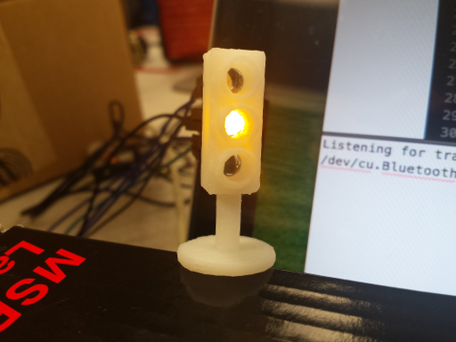
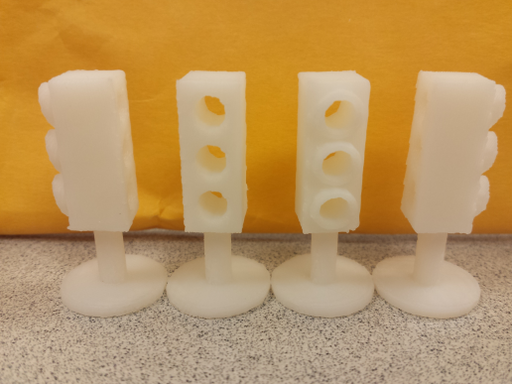

# Traffic Light
MSP430 (or Arduino) powered traffic light and controlled by the computer

## Live Demo

## Images

## Thanks
[Rahul Roy](http://www.linkedin.com/pub/rahul-roy/34/5a/7aa) for making the 3D models included